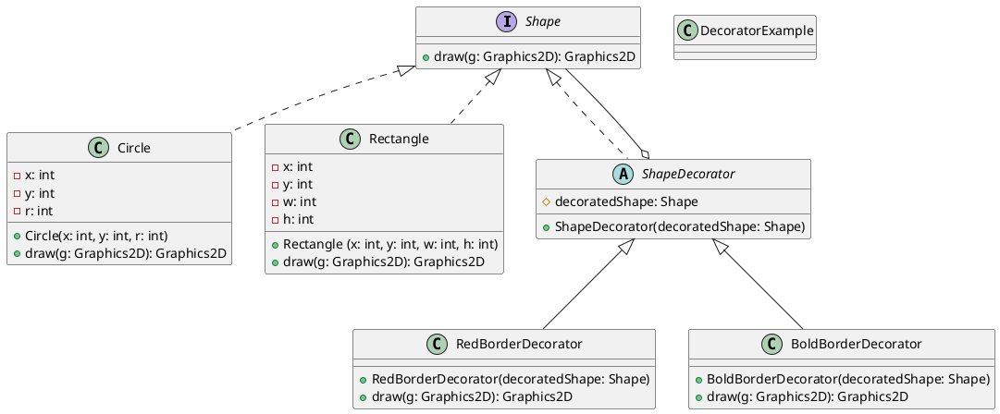

---
# 786
weight: 900
---

# GOF Design Patterns : Decorator

## Introduction

**The Decorator Design Pattern** is one of the Gang of Four (GoF) design patterns that fall under the **Structural Design Patterns**. The objective of this pattern is to dynamically add additional behaviours to an object without modifying the original base object.

By allowing us to update objects' behaviour without touching the base class, this pattern preserves the **Open-Closed Principle**, which comes under the SOLID Principles. Also, this adheres to SOLID’s **Single-Responsibility Principle** as the base class only needs to handle drawing the base object, and decorators are responsible for adding specific behaviours to the object dynamically.

Following is the Gang of Four Definition of the Decorator Design Pattern,

> The Decorator Design Pattern is a design pattern that allows behavior to be added to an individual object dynamically, without affecting the behavior of other instances of the same class.

## Example

In order to get a solid understanding, let’s look at an example.

Assume we are building an application that can draw circles and rectangles, and there can be several types of decorations we can add to these shapes dynamically. Also, we expect that there will be more decorations added to the system over time.

For now, assume we have circle and rectangle shapes with additional decorations of red border and bold border. Now, one way to solve this is by creating subclasses for each possibility, such as 

* Basic Circle 
* Red Border Circle
* Bold Border Circle
* Red Bold Border Circle
* Basic Rectangle
* Red Border Rectangle
* Bold Border Rectangle
* Red Bold Border Rectangle

As we can see, this is not the solution we need. We want a more robust, flexible solution where we can maintain decorations and shapes separately and attach them dynamically. That’s where the decorator design pattern comes into concern.

### Output


### Class Diagram

Now, before digging into code, let’s see what our Decorator Pattern Class Diagram looks like.




### Code

Now Let’s Code

Shape Interface
```java
interface Shape {
    void draw(Graphics2D g);
}
```

Basic Shapes
```java
class Circle implements Shape {

    int x;
    int y;
    int r;

    public Circle(int x, int y, int r) {
        this.x = x;
        this.y = y;
        this.r = r;
    }

    @Override
    public void draw(Graphics2D g) {
        g.drawOval(x - r, y - r, 2 * r, 2 * r);
    }
}

class Rectangle implements Shape {

    int x;
    int y;
    int w;
    int h;

    public Rectangle(int x, int y, int w, int h) {
        this.x = x;
        this.y = y;
        this.w = w;
        this.h = h;
    }

    @Override
    public void draw(Graphics2D g) {
        g.drawRect(x, y, w, h);
    }
}
```

Decorator Interface
```java
abstract class ShapeDecorator implements Shape {

    protected Shape decoratedShape;

    ShapeDecorator(Shape decoratedShape) {
        this.decoratedShape = decoratedShape;
    }

}
```

Red Border Decorator
```java
class RedBorderDecorator extends ShapeDecorator {

    RedBorderDecorator(Shape decoratedShape) {
        super(decoratedShape);
    }

    @Override
    public void draw(Graphics2D g) {
        g.setColor(Color.RED);
        decoratedShape.draw(g);
    }
}
```
Bold Border Decorator
```java
class BoldBorderDecorator extends ShapeDecorator {

    BoldBorderDecorator(Shape decoratedShape) {
        super(decoratedShape);
    }

    @Override
    public void draw(Graphics2D g) {
        g.setStroke(new BasicStroke(6));
        decoratedShape.draw(g);
    }
}
```

Usage
```java
public class DecoratorExample {
    public static void main(String[] args) {
        JFrame frame = new JFrame("Custom Draw Method");
        frame.setSize(400, 400);
        frame.setDefaultCloseOperation(JFrame.EXIT_ON_CLOSE);

        JPanel panel = new JPanel() {
            @Override
            protected void paintComponent(Graphics g) {
                super.paintComponent(g);

                // Make 2D
                Graphics2D g2 = (Graphics2D) g;

                // Basic Shapes
                new Circle(100, 100, 80).draw(g2);
                new Rectangle(50, 50, 100, 100).draw(g2);
                resetGraphics(g2);

                // Red Border Shapes
                new RedBorderDecorator(new Circle(300, 100, 80)).draw(g2);
                new RedBorderDecorator(new Rectangle(250, 50, 100, 100)).draw(g2);
                resetGraphics(g2);

                // Bold Border Shapes
                new BoldBorderDecorator(new Circle(100, 300, 80)).draw(g2);
                new BoldBorderDecorator(new Rectangle(50, 250, 100, 100)).draw(g2);
                resetGraphics(g2);

                // Drawing Red & Bold Border Shapes
                new BoldBorderDecorator(new RedBorderDecorator(new Circle(300, 300, 80))).draw(g2);
                new BoldBorderDecorator(new RedBorderDecorator(new Rectangle(250, 250, 100, 100))).draw(g2);
            }

            private void resetGraphics(Graphics2D g) {
                g.setColor(Color.BLACK);
                g.setStroke(new BasicStroke(1));
            }
        };

        frame.add(panel);
        frame.setVisible(true);
    }
}
```
Output


As we can see, here we are maintaining shapes and decoration separately (**seperation of conerns**) and we can attach decorations to shapes without touching the shape class (**open-close principle**). Also, each class is only responsible for it’s own task, like drawing a basic shape, making the border red color, making the border bold, etc, which fulfills the **single responsibility** principle. Likewise, we can use this pattern to build robust applications, where we can attach additional behaviours to basic behaviours dynamically and in a cleaner way while adhering to SOLID principles.

That’s all for **The Decorator Design Pattern** for now.\
Thank you !\
Happy Coding  🙌