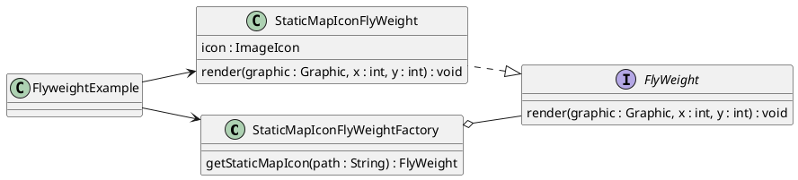

---
# 786
weight: 800
---

# GOF Design Patterns : Flyweight

## Introduction

The Flyweight Design Pattern is a **Structural Design Pattern** used to optimize the memory usage. The Gang of Four (GoF) definition of the Flyweight Design Pattern is as follows,

> A Software Design Pattern refers to an object that minimizes memory usage by sharing some of its data with other similar objects.

The main concept behind this pattern is that, without repeating shared properties across objects in different memory spaces, we can move them to a single common memory location and let each object refer to the properties in this common shared location. (since these common properties are shared, these properties should be immutable)

> **Simply put, saving memory through reusing shared properties, without creating new ones.**

## Example

Let's clarify the idea through a simple example. Assume we have to draw 500 trees and 50 rocks on a canvas, which represents an image of a forest, as shown below.


Each tree and rock in the image represents a separate object in memory. First, let's try to draw this without applying the Flyweight Design Pattern.

### Without Flyweight

```java
package org.demo;

import javax.swing.*;
import java.awt.*;
import java.io.Serial;
import java.net.URL;
import java.util.Random;

interface MapIcon {
    void render(Graphics graphic);
}

public class NonFlyweightExample {

    private static final int FRAME_WIDTH = 400;
    private static final int FRAME_HEIGHT = 300;

    public static void main(String[] args) {

        JFrame frame = new JFrame("No Flyweight Example");
        frame.setDefaultCloseOperation(JFrame.EXIT_ON_CLOSE);
        frame.setSize(FRAME_WIDTH, FRAME_HEIGHT);
        frame.setResizable(false);

        Random rand = new Random();

        JPanel panel = new JPanel() {
            @Serial
            private static final long serialVersionUID = 1L;

            @Override
            protected void paintComponent(Graphics g) {
                super.paintComponent(g);
                for (int i = 0; i < 50; i++) {
                    new StaticMapIcon(IconLoader
                            .loadFromResourcePath("/rock.png"),
                            rand.nextInt(-10, FRAME_WIDTH + 10),
                            rand.nextInt(-10, FRAME_HEIGHT + 10))
                            .render(g);
                }
                for (int i = 0; i < 500; i++) {
                    new StaticMapIcon(IconLoader
                            .loadFromResourcePath("/tree.png"),
                            rand.nextInt(-10, FRAME_WIDTH + 10),
                            rand.nextInt(-10, FRAME_HEIGHT + 10))
                            .render(g);
                }
            }
        };
        panel.setBackground(Color.YELLOW);
        frame.add(panel);
        frame.setVisible(true);
        frame.paint(frame.getGraphics());
        SwingUtilities.invokeLater(() -> {
            System.out.printf("Image Load Count : %d%n", IconLoader.IMAGE_LOAD_COUNT);
        });
    }

}

class StaticMapIcon implements MapIcon {

    private final ImageIcon icon;
    private final int x;
    private final int y;

    public StaticMapIcon(ImageIcon icon, int x, int y) {
        this.icon = icon;
        this.x = x;
        this.y = y;
    }

    @Override
    public void render(Graphics graphic) {
        graphic.drawImage(icon.getImage(), x, y, null);
    }

}

class IconLoader {
    static int IMAGE_LOAD_COUNT = 0;

    public static ImageIcon loadFromResourcePath(String resourcePath) {
        URL url = IconLoader.class.getResource(resourcePath);

        ImageIcon icon = new ImageIcon(url);
        Image resizedImage = icon.getImage().getScaledInstance(30, 30, Image.SCALE_SMOOTH);
        IMAGE_LOAD_COUNT = IMAGE_LOAD_COUNT + 1;

        return new ImageIcon(resizedImage);
    }
}
```

```text
Starting Gradle Daemon...
Gradle Daemon started in 11 s 400 ms
> Task :compileJava
> Task :processResources
> Task :classes

> Task :org.demo.NonFlyweightExample.main()
Image Load Count : 1100
```

As we can see, the application had to load and store the images of tree/rock 1100 times in memory. This led to inefficient memory usage.

Now, let's see how we can improve efficiency by using the Flyweight Design Pattern.

### With Flyweight

In Order to apply the Flyweight Design Pattern, we need to follow these steps.

1. Identify shared properties between objects and mark them as Intrinsic Properties. In our example, the image is shared among objects (Shared).
2. Identify unique properties to the object and mark them as Extrinsic Properties. Here, x and y coordinates are unique to each object (Not Shared).
3. Introduce Flyweight Factory to Create the Objects.
4. Maintain unique instances of Intrinsic Properties within the Flyweight Factory and let each object use the same shared object.
5. Use a method to take Extrinsic Properties from the client code and allow the client to hand over Extrinsic Properties Runtime.

```java
package org.demo;

import javax.swing.*;
import java.awt.*;
import java.io.Serial;
import java.net.URL;
import java.util.HashMap;
import java.util.Map;
import java.util.Random;

interface FlyWeight {
    void render(Graphics graphic, int x, int y);
}

public class FlyweightExample {

    private static final int FRAME_WIDTH = 400;
    private static final int FRAME_HEIGHT = 300;

    public static void main(String[] args) {

        JFrame frame = new JFrame("Flyweight Example");
        frame.setDefaultCloseOperation(JFrame.EXIT_ON_CLOSE);
        frame.setSize(FRAME_WIDTH, FRAME_HEIGHT);
        frame.setResizable(false);

        Random rand = new Random();

        JPanel panel = new JPanel() {
            @Serial
            private static final long serialVersionUID = 1L;

            @Override
            protected void paintComponent(Graphics g) {
                super.paintComponent(g);
                for (int i = 0; i < 50; i++) {
                    StaticMapIconFlyWeightFactory.getStaticMapIcon("/rock.png")
                            .render(g, rand.nextInt(-10, FRAME_WIDTH + 10), rand.nextInt(-10, FRAME_HEIGHT + 10));
                }
                for (int i = 0; i < 500; i++) {
                    StaticMapIconFlyWeightFactory.getStaticMapIcon("/tree.png")
                            .render(g, rand.nextInt(-10, FRAME_WIDTH + 10), rand.nextInt(-10, FRAME_HEIGHT + 10));
                }
            }
        };
        panel.setBackground(Color.YELLOW);
        frame.add(panel);
        frame.setVisible(true);
        frame.paint(frame.getGraphics());
        SwingUtilities.invokeLater(() -> {
            System.out.printf("Image Load Count : %d%n", IconLoader.IMAGE_LOAD_COUNT);
        });
    }

}

class StaticMapIconFlyWeightFactory {

    static Map<String, ImageIcon> iconCache = new HashMap<>();

    public static FlyWeight getStaticMapIcon(String path) {
        ImageIcon icon = iconCache.computeIfAbsent(path, (p) -> IconLoader.loadFromResourcePath(path));
        return new StaticMapIconFlyWeight(icon);
    }

    static class StaticMapIconFlyWeight implements FlyWeight {

        private final ImageIcon icon;

        private StaticMapIconFlyWeight(ImageIcon icon) {
            this.icon = icon;
        }

        @Override
        public void render(Graphics graphic, int x, int y) {
            graphic.drawImage(icon.getImage(), x, y, null);
        }

    }

}

class IconLoader {
    static int IMAGE_LOAD_COUNT = 0;

    public static ImageIcon loadFromResourcePath(String resourcePath) {
        URL url = IconLoader.class.getResource(resourcePath);

        ImageIcon icon = new ImageIcon(url);
        Image resizedImage = icon.getImage().getScaledInstance(30, 30, Image.SCALE_SMOOTH);
        IMAGE_LOAD_COUNT = IMAGE_LOAD_COUNT + 1;

        return new ImageIcon(resizedImage);
    }
}
```

```text
Starting Gradle Daemon...
Gradle Daemon started in 1 s 241 ms
> Task :compileJava
> Task :processResources UP-TO-DATE
> Task :classes

> Task :org.demo.FlyweightExample.main()
Image Load Count : 2
```
As we can see now, the application only maintains 2 instances of tree/rock images, which resulted in efficient memory usage.

## Class Diagram




## When to Use

It is recommended to use the Flyweight Pattern when the following requirements are satisfied.

1. A large number of likely objects are maintained within the system.
2. Properties can be divided into Intrinsic and Extrinsic.
3. Object creation is expensive, and each object takes a considerable amount of memory.
4. Memory of the target device is limited (Mobile / Embedded Devices)

That's all about the Flyweight Design Pattern for now.\
Thank You !\
Happy Coding  🙌